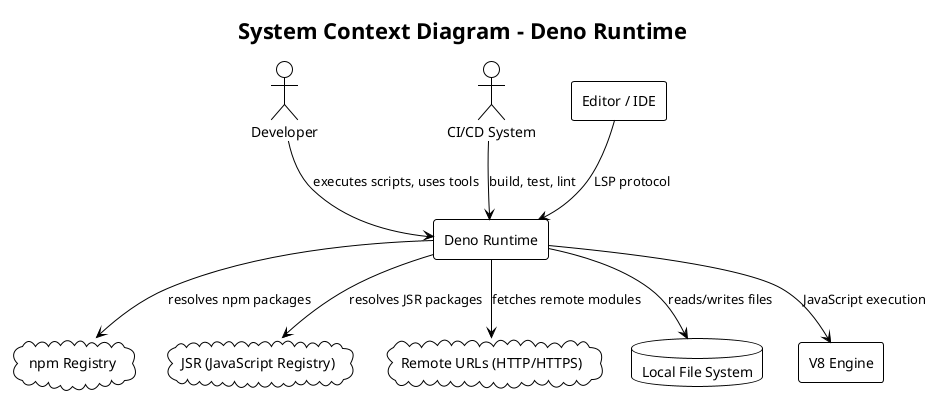
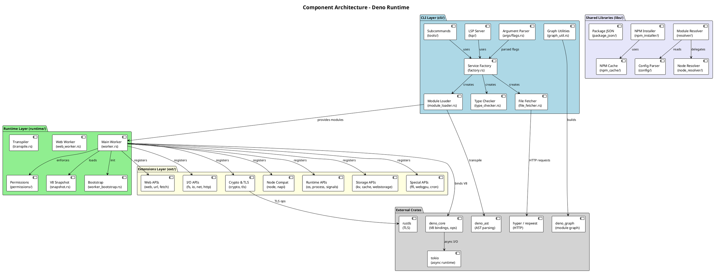
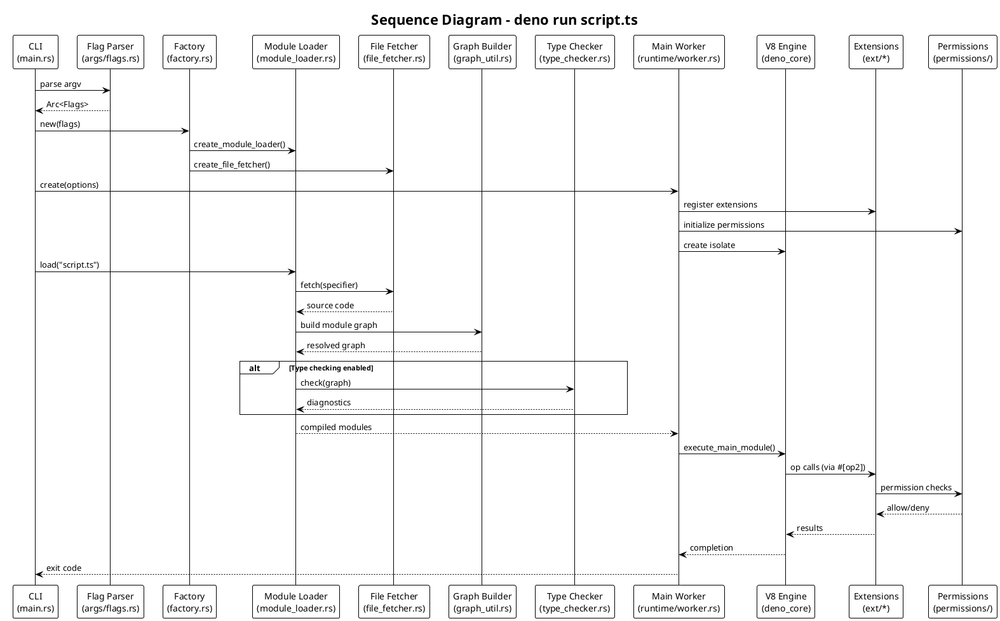
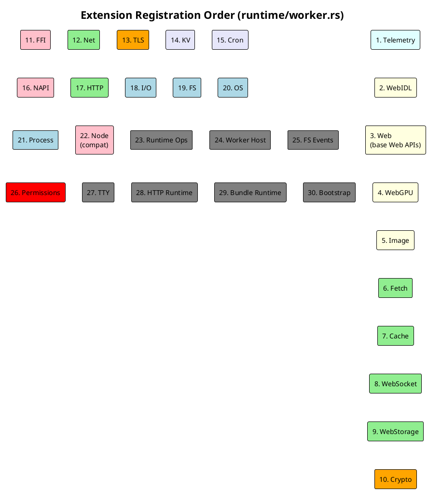
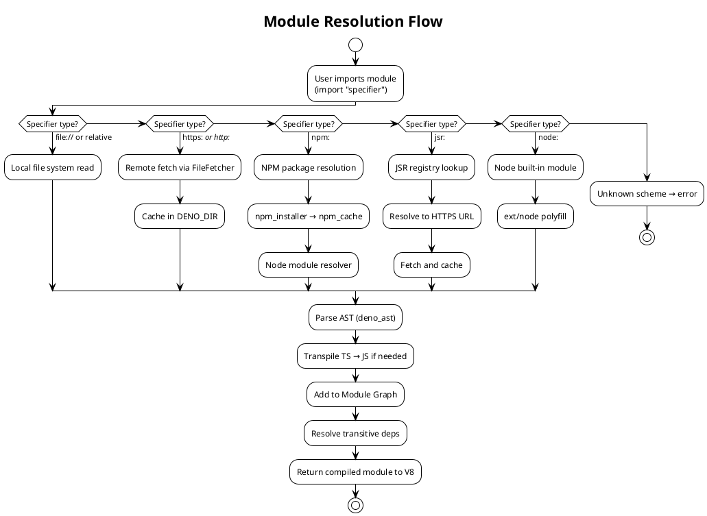
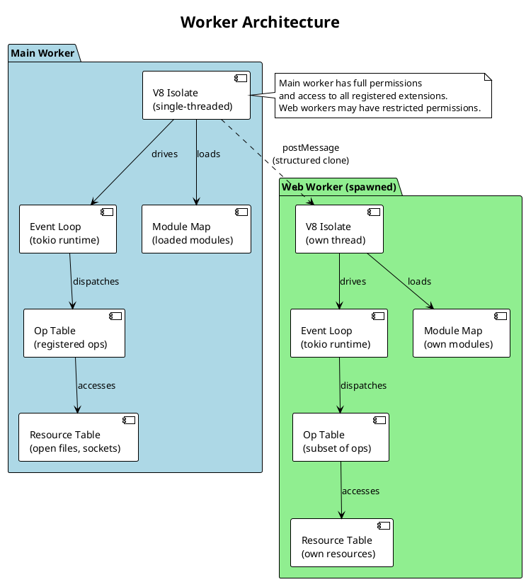
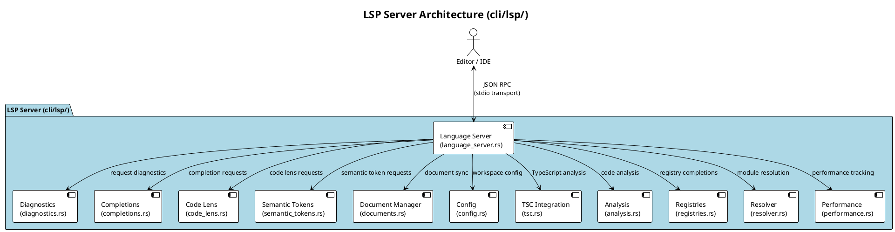

# Architecture Document: Deno Runtime

## 1. Overview

Deno is a modern JavaScript/TypeScript/WebAssembly runtime with secure defaults. It is built on three foundational technologies:

- **V8** — Google's JavaScript engine (via `deno_core` / `rusty_v8`)
- **Rust** — Systems programming language providing memory safety and performance
- **Tokio** — Asynchronous runtime for Rust

Deno provides a single binary (`deno`) that serves as both a runtime and a complete developer toolchain, including a formatter, linter, type checker, test runner, bundler, and LSP server.

## 2. High-Level Design

### 2.1 System Context Diagram

### 2.2 Component Diagram — Architectural Layers

### 2.3 Key Design Decisions

| Decision | Rationale | Alternatives Considered | Source |
|----------|-----------|------------------------|--------|
| Single binary with embedded tools | Developer experience — no separate installs for fmt, lint, test, etc. | Separate binaries per tool | `cli/main.rs`, `cli/tools/` |
| V8 snapshots for fast startup | Avoid re-initializing built-in APIs on every startup | No snapshots (lazy init) | `runtime/snapshot.rs` |
| Permission-based security model | Secure by default — no file/net/env access unless explicitly granted | No sandbox, capability-based | `runtime/permissions/lib.rs` |
| Ops bridge pattern (Rust ↔ JS) | Type-safe, efficient function calls between Rust and JavaScript | Message passing, FFI | `ext/*/` (all `#[op2]` macros) |
| Tokio-based async runtime | Industry-standard async Rust runtime with excellent ecosystem | async-std, smol | `Cargo.toml` workspace deps |
| Factory pattern for service creation | Lazy initialization of only needed services per subcommand | Eager global initialization | `cli/factory.rs` |
| Module graph for dependency resolution | Correct ordering, deduplication, and cycle detection | Linear loading | `cli/graph_util.rs`, `deno_graph` |
| Node.js / npm compatibility | Ecosystem adoption — run npm packages and Node.js code | Pure Deno ecosystem only | `ext/node/`, `libs/node_resolver/` |

## 3. Low-Level Design

### 3.1 Execution Flow — Running a Script

### 3.2 Extension Registration Order

Extensions are registered in a specific order in `runtime/worker.rs` (function `common_extensions`). The order matters because extensions may depend on ops from earlier extensions.

### 3.3 Module Resolution Architecture

### 3.4 Worker Architecture

### 3.5 CLI Subcommand Architecture

The CLI binary exposes numerous subcommands, all dispatched from `run_subcommand()` in `cli/main.rs`:

```plantuml
@startuml
!theme plain
title CLI Subcommand Dispatch

rectangle "deno" as entry

package "Script Execution" #LightBlue {
  [run] as run
  [eval] as eval
  [repl] as repl
  [serve] as serve
  [x] as x
}

package "Development Tools" #LightGreen {
  [fmt] as fmt
  [lint] as lint
  [test] as test
  [bench] as bench
  [check] as check
  [doc] as doc
  [coverage] as coverage
}

package "Package Management" #LightYellow {
  [add] as add
  [remove] as remove
  [install] as install
  [uninstall] as uninstall
  [outdated] as outdated
  [audit] as audit
}

package "Build & Deploy" #Orange {
  [compile] as compile
  [bundle] as bundle
  [deploy] as deploy
  [publish] as publish
}

package "Info & Utilities" #Lavender {
  [info] as info
  [init] as init
  [cache] as cache
  [clean] as clean
  [upgrade] as upgrade
  [lsp] as lsp
  [jupyter] as jupyter
  [completions] as completions
}

entry --> run
entry --> eval
entry --> repl
entry --> serve
entry --> x
entry --> fmt
entry --> lint
entry --> test
entry --> bench
entry --> check
entry --> doc
entry --> coverage
entry --> add
entry --> remove
entry --> install
entry --> uninstall
entry --> outdated
entry --> audit
entry --> compile
entry --> bundle
entry --> deploy
entry --> publish
entry --> info
entry --> init
entry --> cache
entry --> clean
entry --> upgrade
entry --> lsp
entry --> jupyter
entry --> completions

@enduml
```

## 4. Internal Crate Dependency Graph

```plantuml
@startuml
!theme plain
title Internal Crate Dependency Graph

' CLI layer
[deno (cli)] as cli #LightBlue
[deno_lib (cli/lib)] as lib #LightBlue
[deno_snapshots (cli/snapshot)] as snap #LightBlue

' Runtime layer
[deno_runtime (runtime)] as rt #LightGreen
[deno_permissions (runtime/permissions)] as perms #LightGreen
[deno_features (runtime/features)] as feat #LightGreen

' Extension crates
[deno_web] as web #LightYellow
[deno_fetch] as fetch #LightYellow
[deno_net] as net #LightYellow
[deno_http] as http #LightYellow
[deno_fs] as fs #LightYellow
[deno_io] as io #LightYellow
[deno_crypto] as crypto #LightYellow
[deno_node] as node #Pink
[deno_napi] as napi #Pink
[deno_ffi] as ffi #LightYellow
[deno_kv] as kv #LightYellow
[deno_tls] as tls #LightYellow
[deno_url] as url #LightYellow
[deno_webidl] as webidl #LightYellow
[deno_websocket] as ws #LightYellow
[deno_webstorage] as wsto #LightYellow
[deno_cache] as cache #LightYellow
[deno_telemetry] as tel #LightYellow
[deno_os] as os #LightYellow
[deno_process] as proc #LightYellow
[deno_signals] as sig #LightYellow
[deno_webgpu] as webgpu #LightYellow
[deno_image] as image #LightYellow

' Library crates
[deno_config] as config #Lavender
[deno_resolver] as resolver #Lavender
[deno_npm_cache] as npm_cache #Lavender
[deno_npm_installer] as npm_inst #Lavender
[node_resolver] as node_res #Lavender
[deno_package_json] as pkg_json #Lavender

' External
[deno_core] as core #LightGray

' Deps: CLI
cli --> lib
cli --> rt
cli --> snap
lib --> rt
snap --> rt

' Deps: Runtime
rt --> perms
rt --> feat
rt --> web
rt --> fetch
rt --> net
rt --> http
rt --> fs
rt --> io
rt --> crypto
rt --> node
rt --> napi
rt --> ffi
rt --> kv
rt --> tls
rt --> url
rt --> webidl
rt --> ws
rt --> wsto
rt --> cache
rt --> tel
rt --> os
rt --> proc
rt --> sig
rt --> webgpu
rt --> image

' Deps: Libs
cli --> config
cli --> resolver
cli --> npm_cache
cli --> npm_inst
cli --> node_res
cli --> pkg_json

' Deps: Core
rt --> core
web --> core
fetch --> core
net --> core
fs --> core

@enduml
```

## 5. LSP Architecture

## 6. References

- [cli/main.rs](cli/main.rs) — CLI entry point and subcommand dispatch
- [cli/factory.rs](cli/factory.rs) — Service factory for runtime components
- [cli/module_loader.rs](cli/module_loader.rs) — Module loading and resolution
- [cli/args/flags.rs](cli/args/flags.rs) — CLI flag definitions
- [runtime/worker.rs](runtime/worker.rs) — Main worker and extension registration (`common_extensions` at line 1039)
- [runtime/web_worker.rs](runtime/web_worker.rs) — Web Worker implementation
- [runtime/permissions/lib.rs](runtime/permissions/lib.rs) — Permission system (`Permissions` struct at line 3342)
- [runtime/snapshot.rs](runtime/snapshot.rs) — V8 snapshot generation
- [cli/lsp/language_server.rs](cli/lsp/language_server.rs) — LSP server implementation

## Appendix

### Glossary

| Term | Definition |
|------|------------|
| **Op** | A Rust function registered with deno_core that can be called from JavaScript. Defined via `#[op2]` macro. |
| **Extension** | A collection of ops and optional JavaScript code that provides a set of APIs (e.g., `deno_fetch`). |
| **Worker** | A JavaScript execution context with its own V8 isolate, event loop, and resource table. |
| **Resource** | A Rust object (file, socket, etc.) tracked in the resource table, accessible from JS via resource IDs. |
| **Module Graph** | A directed graph of module dependencies, used for correct load ordering and deduplication. |
| **Snapshot** | A serialized V8 heap state that enables fast startup by skipping initialization of built-in APIs. |
| **Specifier** | A module identifier (URL, file path, npm: specifier, jsr: specifier, etc.). |
| **DENO_DIR** | The local cache directory where Deno stores downloaded modules, compiled code, and type check info. |
| **JSR** | JavaScript Registry — Deno's native package registry (jsr.io). |
| **NAPI** | Node-API — compatibility layer for native Node.js addons. |
| **FFI** | Foreign Function Interface — allows calling native shared libraries from JavaScript. |
