# Codebase Structure & Standards

## 1. Project Layout

```plantuml
@startuml
!theme plain
title Deno Project Directory Structure
salt
{
  {T
    + deno/
    ++ cli/                  | Main CLI binary ("deno" crate, v2.6.8)
    +++ args/                | CLI argument parsing, flag definitions
    +++ bench/               | Benchmark utilities
    +++ cache/               | Local caching subsystem
    +++ js/                  | CLI-specific JavaScript runtime code
    +++ lib/                 | CLI library crate (deno_lib)
    +++ lsp/                 | Language Server Protocol implementation
    +++ ops/                 | CLI-specific Rust ops
    +++ rt/                  | CLI runtime helpers
    +++ schemas/             | JSON schemas for configuration
    +++ snapshot/            | V8 snapshot generation (deno_snapshots)
    +++ standalone/          | Standalone binary compilation support
    +++ tools/               | Subcommand implementations (fmt, lint, test, etc.)
    +++ tsc/                 | TypeScript compiler integration
    +++ util/                | Shared CLI utilities
    ++ runtime/              | JavaScript runtime assembly (deno_runtime)
    +++ features/            | Feature flags crate
    +++ js/                  | Runtime JavaScript code
    +++ ops/                 | Runtime-specific ops
    +++ permissions/         | Permission system (deno_permissions)
    +++ subprocess_windows/  | Windows subprocess handling
    ++ ext/                  | Native extensions (30+ crates)
    +++ broadcast_channel/   | BroadcastChannel API
    +++ bundle/              | Bundle runtime
    +++ cache/               | Cache API
    +++ console/             | (deprecated, part of web)
    +++ cron/                | Cron scheduling
    +++ crypto/              | Web Crypto API
    +++ fetch/               | Fetch API
    +++ ffi/                 | Foreign Function Interface
    +++ fs/                  | File System API
    +++ http/                | HTTP server primitives
    +++ image/               | Image processing
    +++ io/                  | I/O primitives (stdin/stdout/stderr)
    +++ kv/                  | Deno KV (key-value store)
    +++ napi/                | Node-API compatibility
    +++ net/                 | Network (TCP/UDP/Unix sockets)
    +++ node/                | Node.js compatibility layer (largest ext)
    +++ os/                  | OS info APIs
    +++ process/             | Process management
    +++ rt_helper/           | Runtime helper (denort)
    +++ signals/             | Signal handling
    +++ telemetry/           | OpenTelemetry integration
    +++ tls/                 | TLS support
    +++ url/                 | URL parsing (WHATWG URL)
    +++ web/                 | Core Web APIs (TextEncoder, etc.)
    +++ webgpu/              | WebGPU API
    +++ webidl/              | WebIDL bindings
    +++ websocket/           | WebSocket API
    +++ webstorage/          | Web Storage API
    ++ libs/                 | Shared workspace libraries
    +++ config/              | deno.json configuration parsing
    +++ crypto/              | Crypto provider
    +++ inspector_server/    | V8 inspector server
    +++ maybe_sync/          | Conditional Send/Sync wrappers
    +++ node_resolver/       | Node.js module resolution
    +++ node_shim/           | Node.js shim
    +++ npm_cache/           | NPM package cache
    +++ npm_installer/       | NPM package installer
    +++ package_json/        | package.json parsing
    +++ resolver/            | Module resolution (deno_resolver)
    +++ typescript_go_client/| TypeScript Go client integration
    ++ tests/                | All test suites
    +++ specs/               | Spec (integration) tests
    +++ unit/                | Deno unit tests (JS)
    +++ unit_node/           | Node.js compatibility unit tests
    +++ integration/         | Rust integration tests
    +++ testdata/            | Test fixtures and data
    +++ node_compat/         | Node.js compatibility tests
    +++ wpt/                 | Web Platform Tests
    +++ napi/                | N-API tests
    +++ ffi/                 | FFI tests
    +++ registry/            | Registry mock tests
    +++ bench_util/          | Benchmark utilities
    ++ tools/                | Development scripts and utilities
  }
}
@enduml
```

## 2. Language & Toolchain Versions

| Tool | Version | Source |
|------|---------|--------|
| Rust | 1.92.0 | `rust-toolchain.toml` |
| Rust Edition | 2024 | `Cargo.toml` `[workspace.package]` |
| deno_core (V8 bindings) | 0.385.0 | `Cargo.toml` `[workspace.dependencies]` |
| deno_ast (AST/transpile) | 0.53.0 | `Cargo.toml` `[workspace.dependencies]` |
| deno_graph (module graph) | 0.107.0 | `Cargo.toml` `[workspace.dependencies]` |
| Tokio (async runtime) | 1.47.1 | `Cargo.toml` `[workspace.dependencies]` |
| Hyper (HTTP) | 1.6.0 | `Cargo.toml` `[workspace.dependencies]` |
| rustls (TLS) | 0.23.28 | `Cargo.toml` `[workspace.dependencies]` |
| clap (CLI parsing) | 4.5.56 | `Cargo.toml` `[workspace.dependencies]` |
| serde (serialization) | 1.0.149 | `Cargo.toml` `[workspace.dependencies]` |

## 3. Naming Conventions

| Context | Convention | Example |
|---------|-----------|---------|
| Rust files | snake_case | `file_fetcher.rs`, `module_loader.rs` |
| Rust types/traits | CamelCase | `CliFactory`, `ModuleLoader`, `Permissions` |
| Rust functions/variables | snake_case | `run_subcommand`, `create_and_run_current_thread` |
| Rust constants | SCREAMING_SNAKE_CASE | `MODULE_NOT_FOUND`, `UNSUPPORTED_SCHEME` |
| Extension crate names | `deno_<name>` | `deno_fetch`, `deno_crypto`, `deno_node` |
| Library crate names | `deno_<name>` / `node_<name>` | `deno_config`, `node_resolver` |
| TypeScript/JS files | snake_case | `format.js`, `lint.js` |
| Test directories | snake_case | `tests/specs/`, `tests/unit/` |
| Copyright header | Required in all files | `// Copyright 2018-2026 the Deno authors. MIT license.` |

## 4. Build Configuration

### Build Profiles

| Profile | LTO | Opt Level | Codegen Units | Use Case |
|---------|-----|-----------|---------------|----------|
| `dev` | off | 0 (some crates higher) | default | Development iteration |
| `release` | full | 'z' (size) | 1 | Production builds |
| `release-lite` | thin | 'z' (size) | 128 | Faster compile, CI |
| `release-with-debug` | thin | 'z' (size) | 128 | Profiling with debug symbols |

### Feature Flags

| Feature | Crate | Purpose |
|---------|-------|---------|
| `dhat-heap` | `deno` (cli) | Heap profiling with dhat |
| `__runtime_js_sources` | `deno_runtime` | Include JS sources for debugging |
| `workspace` | `deno_config` | Workspace configuration support |
| `transpiling` | `deno_ast` | TypeScript transpilation |

## 5. Workspace Crate Inventory

### CLI Crates

| Crate | Path | Version |
|-------|------|---------|
| `deno` | `cli/` | 2.6.8 |
| `deno_lib` | `cli/lib/` | 0.48.0 |
| `deno_snapshots` | `cli/snapshot/` | 0.45.0 |

### Runtime Crates

| Crate | Path | Version |
|-------|------|---------|
| `deno_runtime` | `runtime/` | 0.238.0 |
| `deno_permissions` | `runtime/permissions/` | 0.89.0 |
| `deno_features` | `runtime/features/` | 0.27.0 |
| `deno_subprocess_windows` | `runtime/subprocess_windows/` | 0.25.0 |

### Extension Crates

| Crate | Path | Version |
|-------|------|---------|
| `deno_web` | `ext/web/` | 0.261.0 |
| `deno_fetch` | `ext/fetch/` | 0.254.0 |
| `deno_webidl` | `ext/webidl/` | 0.230.0 |
| `deno_websocket` | `ext/websocket/` | 0.235.0 |
| `deno_webstorage` | `ext/webstorage/` | 0.225.0 |
| `deno_crypto` | `ext/crypto/` | 0.244.0 |
| `deno_net` | `ext/net/` | 0.222.0 |
| `deno_http` | `ext/http/` | 0.228.0 |
| `deno_tls` | `ext/tls/` | 0.217.0 |
| `deno_fs` | `ext/fs/` | 0.140.0 |
| `deno_io` | `ext/io/` | 0.140.0 |
| `deno_kv` | `ext/kv/` | 0.138.0 |
| `deno_node` | `ext/node/` | 0.168.0 |
| `deno_napi` | `ext/napi/` | 0.161.0 |
| `napi_sym` | `ext/napi/sym/` | 0.160.0 |
| `deno_ffi` | `ext/ffi/` | 0.217.0 |
| `deno_cache` | `ext/cache/` | 0.163.0 |
| `deno_cron` | `ext/cron/` | 0.110.0 |
| `deno_telemetry` | `ext/telemetry/` | 0.52.0 |
| `deno_url` | `ext/url/` | (ext/url/) |
| `deno_webgpu` | `ext/webgpu/` | 0.197.0 |
| `deno_image` | `ext/image/` | 0.6.0 |
| `deno_os` | `ext/os/` | 0.47.0 |
| `deno_process` | `ext/process/` | 0.45.0 |
| `deno_signals` | `ext/signals/` | 0.21.0 |
| `deno_bundle_runtime` | `ext/bundle/` | 0.17.0 |
| `denort_helper` | `ext/rt_helper/` | 0.28.0 |

### Library Crates

| Crate | Path | Version |
|-------|------|---------|
| `deno_config` | `libs/config/` | 0.80.0 |
| `deno_resolver` | `libs/resolver/` | 0.61.0 |
| `deno_npm_cache` | `libs/npm_cache/` | 0.49.0 |
| `deno_npm_installer` | `libs/npm_installer/` | 0.25.0 |
| `node_resolver` | `libs/node_resolver/` | 0.68.0 |
| `deno_package_json` | `libs/package_json/` | 0.32.0 |
| `deno_crypto_provider` | `libs/crypto/` | 0.24.0 |
| `deno_inspector_server` | `libs/inspector_server/` | 0.4.0 |
| `deno_maybe_sync` | `libs/maybe_sync/` | 0.17.0 |
| `node_shim` | `libs/node_shim/` | 0.5.0 |
| `deno_typescript_go_client_rust` | `libs/typescript_go_client/` | 0.12.0 |

## 6. Key External Dependencies

| Crate | Version | Purpose |
|-------|---------|---------|
| `deno_core` | 0.385.0 | V8 bindings, op framework, module loading |
| `deno_ast` | 0.53.0 | AST parsing, transpilation |
| `deno_graph` | 0.107.0 | Module dependency graph |
| `deno_lint` | 0.83.0 | JavaScript/TypeScript linting |
| `deno_doc` | 0.190.1 | Documentation generation |
| `deno_lockfile` | 0.32.2 | Lockfile handling |
| `deno_npm` | 0.43.0 | NPM registry protocol |
| `deno_semver` | 0.9.1 | Semver version resolution |
| `deno_task_shell` | 0.28.0 | Task runner shell |
| `tokio` | 1.47.1 | Async runtime |
| `hyper` | 1.6.0 | HTTP implementation |
| `reqwest` | 0.12.5 | HTTP client |
| `rustls` | 0.23.28 | TLS implementation |
| `rusqlite` | 0.37.0 | SQLite (for cache, KV) |
| `clap` | 4.5.56 | CLI argument parsing |
| `serde` / `serde_json` | 1.0.149 | Serialization framework |
| `anyhow` | 1.0.57 | Error handling |
| `eszip` | 0.109.0 | ESZip module bundling |

## 7. Clippy Enforcement Rules

### CLI Crate (`cli/clippy.toml`)

| Disallowed | Replacement | Reason |
|------------|-------------|--------|
| `reqwest::Client::new` | `HttpClient` via `HttpClientProvider` | Centralized HTTP client config |
| `reqwest::Client` (type) | `crate::http_util::HttpClient` | Consistent HTTP abstraction |
| `std::process::exit` | `deno_runtime::exit` | Proper cleanup on exit |
| `clap::Arg::env` | Manual env resolution | Resolve after loading `.env` files |
| `tokio::signal::*` | `deno_signals` crate | Cross-platform signal handling |
| `sys_traits::impls::RealSys` | `crate::sys::CliSys` | Consistent system interface |

### Runtime Crate (`runtime/clippy.toml`)

| Disallowed | Replacement | Reason |
|------------|-------------|--------|
| `std::fs::*` operations | `FileSystem` / `NodeFs` trait | Sandboxed file system access |
| `std::path::Path::*` fs ops | `FileSystem` trait | Permission-checked FS |
| `std::env::current_dir` | `FileSystem` trait | Sandboxed environment |
| `std::env::set_current_dir` | `FileSystem` trait | Sandboxed environment |
| `std::env::temp_dir` | `FileSystem` trait | Sandboxed temp access |
| `std::process::exit` | `deno_runtime::exit` | Proper cleanup on exit |

## 8. Development Tools Configuration

| Tool | Config File | Purpose |
|------|-------------|---------|
| dprint | `.dprint.json` | Code formatting (TS/JS/JSON/Markdown) |
| dlint | `.dlint.json` | JavaScript/TypeScript linting |
| rustfmt | `rustfmt.toml` (default) | Rust formatting (via toolchain) |
| clippy | `cli/clippy.toml`, `runtime/clippy.toml` | Rust domain-specific linting |
| deno | `tools/deno.json` | Tooling scripts configuration |

## References

- [Cargo.toml](Cargo.toml) — Workspace configuration, all members and dependencies
- [rust-toolchain.toml](rust-toolchain.toml) — Rust toolchain version
- [cli/clippy.toml](cli/clippy.toml) — CLI clippy enforcement rules
- [runtime/clippy.toml](runtime/clippy.toml) — Runtime clippy enforcement rules
- [tools/deno.json](tools/deno.json) — Development tooling scripts configuration
