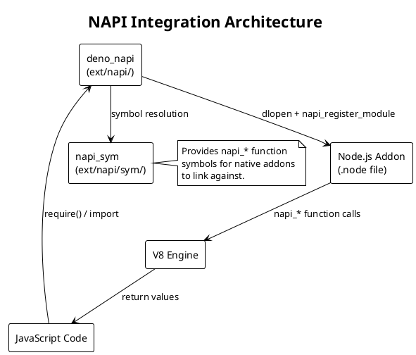

# API Contracts & Interfaces

## 1. Overview

Deno exposes its functionality through several distinct API surfaces:

1. **CLI Interface** — Subcommands, flags, and arguments
2. **Runtime Ops** — Rust ↔ JavaScript bridge functions (`#[op2]` decorated)
3. **JavaScript APIs** — Built-in APIs exposed to user code (Deno namespace, Web APIs)
4. **LSP Protocol** — Language Server Protocol for editor integration
5. **FFI Boundary** — Foreign Function Interface for native libraries
6. **NAPI Boundary** — Node-API compatibility for native addons

> **Note:** Deno is a CLI/runtime application, not a web service. **No REST/GraphQL/RPC endpoints detected.** The primary API contracts are the CLI interface and the JavaScript runtime APIs.

## 2. CLI Interface

All CLI arguments are defined in `cli/args/flags.rs`. The `DenoSubcommand` enum at line 599 enumerates all available subcommands.

### 2.1 Subcommand Reference

| Subcommand | Flags Struct | Handler Location | Description |
|------------|-------------|------------------|-------------|
| `run` | `RunFlags` | `cli/tools/run/` | Execute a script |
| `serve` | `ServeFlags` | `cli/tools/serve.rs` | Start an HTTP server |
| `eval` | `EvalFlags` | `cli/tools/run/` | Evaluate inline code |
| `repl` | `ReplFlags` | `cli/tools/repl/` | Interactive REPL |
| `x` | `XFlags` | `cli/tools/x.rs` | Execute a remote script |
| `fmt` | `FmtFlags` | `cli/tools/fmt.rs` | Format source code |
| `lint` | `LintFlags` | `cli/tools/lint/` | Lint source code |
| `test` | `TestFlags` | `cli/tools/test/` | Run tests |
| `bench` | `BenchFlags` | `cli/tools/bench/` | Run benchmarks |
| `check` | `CheckFlags` | `cli/tools/check.rs` | Type check TypeScript |
| `doc` | `DocFlags` | `cli/tools/doc.rs` | Generate documentation |
| `coverage` | `CoverageFlags` | `cli/tools/coverage/` | Report test coverage |
| `compile` | `CompileFlags` | `cli/tools/compile.rs` | Compile to standalone binary |
| `bundle` | `BundleFlags` | `cli/tools/bundle/` | Bundle modules (experimental) |
| `deploy` | `DeployFlags` | `cli/tools/deploy.rs` | Deploy to Deno Deploy |
| `publish` | `PublishFlags` | `cli/tools/publish/` | Publish to JSR registry |
| `add` | `AddFlags` | `cli/tools/pm/` | Add dependency to deno.json |
| `remove` | `RemoveFlags` | `cli/tools/pm/` | Remove dependency |
| `install` | `InstallFlags` | `cli/tools/installer/` | Install script as executable |
| `uninstall` | `UninstallFlags` | `cli/tools/installer/` | Uninstall script |
| `outdated` | `OutdatedFlags` | `cli/tools/pm/` | Check for outdated deps |
| `audit` | `AuditFlags` | `cli/tools/pm/` | Audit dependencies |
| `cache` | `CacheFlags` | `cli/tools/installer/` | Download and cache deps |
| `info` | `InfoFlags` | `cli/tools/info.rs` | Show module/cache info |
| `init` | `InitFlags` | `cli/tools/init/` | Initialize new project |
| `clean` | `CleanFlags` | `cli/tools/clean.rs` | Clean the cache |
| `upgrade` | `UpgradeFlags` | `cli/tools/upgrade.rs` | Upgrade Deno binary |
| `lsp` | (none) | `cli/lsp/` | Language Server Protocol |
| `jupyter` | `JupyterFlags` | `cli/tools/jupyter/` | Jupyter kernel |
| `completions` | `CompletionsFlags` | CLI built-in | Shell completions |
| `types` | (none) | CLI built-in | Print TypeScript declarations |

### 2.2 Global Permission Flags

| Flag | Type | Description |
|------|------|-------------|
| `--allow-read[=<paths>]` | Optional paths | Allow file system read access |
| `--allow-write[=<paths>]` | Optional paths | Allow file system write access |
| `--allow-net[=<hosts>]` | Optional hosts | Allow network access |
| `--allow-env[=<vars>]` | Optional var names | Allow environment variable access |
| `--allow-sys[=<apis>]` | Optional API names | Allow system info access |
| `--allow-run[=<programs>]` | Optional programs | Allow subprocess execution |
| `--allow-ffi[=<paths>]` | Optional paths | Allow FFI (native library) access |
| `--allow-import[=<hosts>]` | Optional hosts | Allow remote module imports |
| `--deny-read[=<paths>]` | Optional paths | Deny file system read access |
| `--deny-write[=<paths>]` | Optional paths | Deny file system write access |
| `--deny-net[=<hosts>]` | Optional hosts | Deny network access |
| `--deny-env[=<vars>]` | Optional var names | Deny environment variable access |
| `--deny-sys[=<apis>]` | Optional API names | Deny system info access |
| `--deny-run[=<programs>]` | Optional programs | Deny subprocess execution |
| `--deny-ffi[=<paths>]` | Optional paths | Deny FFI access |
| `--deny-import[=<hosts>]` | Optional hosts | Deny remote imports |
| `-A` / `--allow-all` | Boolean | Allow all permissions |

### 2.3 Common Global Flags

| Flag | Type | Description |
|------|------|-------------|
| `--config <file>` | Path | Path to deno.json config file |
| `--no-config` | Boolean | Disable auto config discovery |
| `--import-map <file>` | Path/URL | Import map file |
| `--lock <file>` | Path | Lock file path |
| `--no-lock` | Boolean | Disable lockfile |
| `--frozen-lockfile` | Boolean | Error on lockfile changes |
| `--node-modules-dir[=<mode>]` | Optional mode | Manage node_modules |
| `--env-file[=<file>]` | Optional path | Load .env file |
| `--v8-flags=<flags>` | String | V8 engine flags |
| `--log-level <level>` | debug/info/warn/error | Set log level |
| `--quiet` | Boolean | Suppress output |
| `--unstable` | Boolean | Enable unstable features |

## 3. Runtime Ops (Rust ↔ JavaScript Bridge)

Ops are the fundamental mechanism for JavaScript code to call into Rust. They are defined with the `#[op2]` macro from `deno_core` and registered via extensions.

### 3.1 Op Pattern

```rust
// Example: File system op from ext/fs/ops.rs
#[op2(stack_trace)]
pub fn op_read_file_sync<P>(
    state: &mut OpState,
    #[string] path: &str,
) -> Result<ToJsBuffer, FsOpsError>
where
    P: FsPermissions + 'static,
{
    let fs = state.borrow::<Arc<dyn FileSystem>>();
    let permissions = state.borrow_mut::<P>();
    permissions.check_read(path)?;
    let buf = fs.read_file_sync(Path::new(path))?;
    Ok(buf.into())
}
```

### 3.2 Ops by Extension Category

#### Web APIs (`ext/web/`, `ext/url/`, `ext/webidl/`)

Core Web platform APIs including `TextEncoder`, `TextDecoder`, `URL`, `URLSearchParams`, `Blob`, `File`, `ReadableStream`, `WritableStream`, `TransformStream`, `AbortController`, `AbortSignal`, `Performance`, `MessagePort`, `MessageChannel`, `structuredClone`, `atob`, `btoa`, and Web IDL type conversions.

#### Fetch API (`ext/fetch/`)

`fetch()` implementation with `Request`, `Response`, `Headers`, and `FormData`. Supports HTTP/1.1 and HTTP/2 via hyper.

#### File System (`ext/fs/`)

65+ ops covering: `open`, `read`, `write`, `seek`, `stat`, `lstat`, `mkdir`, `readdir`, `remove`, `rename`, `copy`, `link`, `symlink`, `readlink`, `truncate`, `chmod`, `chown`, `utime`, `realpath`, `cwd`, `umask`, `flock`, `funlock`, `fdatasync`, `fsync`, `ftruncate`, `fstat`.

#### Network (`ext/net/`)

TCP, UDP, and Unix socket ops: `listen`, `accept`, `connect`, `send`, `receive`, `shutdown`, `set_nodelay`, `set_keepalive`.

#### HTTP Server (`ext/http/`)

HTTP server primitives using hyper: `serve`, `accept`, `read_request`, `write_response`, `upgrade`.

#### Crypto (`ext/crypto/`)

Web Crypto API: `getRandomValues`, `randomUUID`, `subtle.encrypt`, `subtle.decrypt`, `subtle.sign`, `subtle.verify`, `subtle.digest`, `subtle.generateKey`, `subtle.importKey`, `subtle.exportKey`, `subtle.deriveBits`, `subtle.deriveKey`, `subtle.wrapKey`, `subtle.unwrapKey`.

#### Node.js Compatibility (`ext/node/`)

The largest extension — provides Node.js built-in module polyfills (`fs`, `path`, `crypto`, `http`, `net`, `buffer`, `stream`, `child_process`, `os`, `events`, `util`, `zlib`, `url`, `querystring`, `assert`, `tty`, `dns`, etc.).

#### FFI (`ext/ffi/`)

Foreign Function Interface for calling native shared libraries from JavaScript. Ops for: `dlopen`, `call`, `ptr_view`, type conversion, callbacks.

#### Key-Value Store (`ext/kv/`)

Deno KV database ops: `open`, `get`, `set`, `delete`, `list`, `atomic`, `enqueue`, `commit`, `watch`.

#### I/O (`ext/io/`)

Low-level I/O: `stdin`, `stdout`, `stderr`, `read`, `write`, `close`.

#### Process (`ext/process/`)

Subprocess management: `spawn`, `kill`, `wait`, signal handling.

#### OS Info (`ext/os/`)

System information: `hostname`, `osRelease`, `osUptime`, `memoryUsage`, `loadavg`, `networkInterfaces`, `gid`, `uid`.

#### Signals (`ext/signals/`)

Signal handling: `signal`, `clearSignal`.

#### TLS (`ext/tls/`)

TLS connections: `connectTls`, `listenTls`, `startTls`.

#### WebSocket (`ext/websocket/`)

WebSocket client/server: `connect`, `send`, `close`, `accept`.

#### WebStorage (`ext/webstorage/`)

`localStorage` and `sessionStorage` backed by SQLite.

#### Cache API (`ext/cache/`)

Web Cache API: `open`, `match`, `put`, `delete`.

#### WebGPU (`ext/webgpu/`)

WebGPU compute and rendering API.

#### Image (`ext/image/`)

Image decoding (`ImageBitmap`, `createImageBitmap`).

#### Cron (`ext/cron/`)

Scheduled task execution (`Deno.cron()`).

#### Telemetry (`ext/telemetry/`)

OpenTelemetry integration for tracing and metrics.

## 4. LSP Protocol Implementation

The LSP server is implemented in `cli/lsp/` using the `tower-lsp` framework. Communication occurs over JSON-RPC via stdio transport.

### 4.1 Supported LSP Methods

#### Lifecycle

| Method | Handler | File |
|--------|---------|------|
| `initialize` | `initialize()` | `language_server.rs:4169` |
| `initialized` | `initialized()` | `language_server.rs:4176` |
| `shutdown` | `shutdown()` | `language_server.rs:4223` |

#### Document Synchronization

| Method | Handler | File |
|--------|---------|------|
| `textDocument/didOpen` | `did_open()` | `language_server.rs:4227` |
| `textDocument/didChange` | `did_change()` | `language_server.rs:4233` |
| `textDocument/didSave` | `did_save()` | `language_server.rs:4258` |
| `textDocument/didClose` | `did_close()` | `language_server.rs:4263` |

#### Language Features

| Method | Handler | File |
|--------|---------|------|
| `textDocument/hover` | `hover()` | `language_server.rs:4373` |
| `textDocument/completion` | `completion()` | `language_server.rs:4488` |
| `completionItem/resolve` | `completion_resolve()` | `language_server.rs:4497` |
| `textDocument/codeAction` | `code_action()` | `language_server.rs:4391` |
| `codeAction/resolve` | `code_action_resolve()` | `language_server.rs:4400` |
| `textDocument/codeLens` | `code_lens()` | `language_server.rs:4414` |
| `codeLens/resolve` | `code_lens_resolve()` | `language_server.rs:4423` |
| `textDocument/definition` | (via TSC) | `language_server.rs` |
| `textDocument/references` | `references()` | `language_server.rs:4451` |
| `textDocument/rename` | `rename()` | `language_server.rs:4575` |
| `textDocument/documentSymbol` | `document_symbol()` | `language_server.rs:4350` |
| `textDocument/formatting` | `formatting()` | `language_server.rs:4364` |
| `textDocument/signatureHelp` | `signature_help()` | `language_server.rs:4626` |
| `textDocument/foldingRange` | `folding_range()` | `language_server.rs:4534` |
| `textDocument/semanticTokens/full` | `semantic_tokens_full()` | `language_server.rs:4598` |
| `textDocument/semanticTokens/range` | `semantic_tokens_range()` | `language_server.rs:4612` |
| `textDocument/inlayHint` | `inlay_hint()` | `language_server.rs:4382` |

#### Workspace

| Method | Handler | File |
|--------|---------|------|
| `workspace/didChangeConfiguration` | `did_change_configuration()` | `language_server.rs:4292` |
| `workspace/didChangeWatchedFiles` | `did_change_watched_files()` | `language_server.rs:4311` |
| `workspace/didChangeWorkspaceFolders` | `did_change_workspace_folders()` | `language_server.rs:4325` |
| `workspace/executeCommand` | `execute_command()` | `language_server.rs:4140` |

### 4.2 LSP Module Architecture

```plantuml
@startuml
!theme plain
title LSP Module Responsibilities

package "cli/lsp/" {
  rectangle "language_server.rs" as LS #LightBlue {
    :Main server / method dispatch;
  }
  rectangle "documents.rs" as DOC #LightGreen {
    :Document management and sync;
  }
  rectangle "diagnostics.rs" as DIAG #Orange {
    :Error/warning diagnostics;
  }
  rectangle "completions.rs" as COMP #LightYellow {
    :Code completions;
  }
  rectangle "tsc.rs" as TSC #Pink {
    :TypeScript compiler integration;
  }
  rectangle "config.rs" as CFG #Lavender {
    :Workspace configuration;
  }
  rectangle "resolver.rs" as RES #LightGreen {
    :Module resolution for LSP;
  }
  rectangle "registries.rs" as REG #LightYellow {
    :JSR/npm registry integration;
  }
  rectangle "analysis.rs" as ANA #LightBlue {
    :Code analysis utilities;
  }
  rectangle "code_lens.rs" as CL #LightBlue {
    :Test/reference code lenses;
  }
  rectangle "semantic_tokens.rs" as ST #LightBlue {
    :Semantic highlighting;
  }
  rectangle "performance.rs" as PERF #Gray {
    :Performance tracking;
  }
}

LS --> DOC : manages
LS --> DIAG : requests
LS --> COMP : delegates
LS --> TSC : queries
LS --> CFG : reads
LS --> RES : resolves
LS --> REG : fetches
LS --> ANA : analyzes
LS --> CL : generates
LS --> ST : maps
LS --> PERF : tracks

@enduml
```

## 5. FFI Boundary (`ext/ffi/`)

The FFI extension allows JavaScript to load and call functions from native shared libraries (`.so`, `.dylib`, `.dll`).

### 5.1 JavaScript API

```typescript
const lib = Deno.dlopen("libexample.so", {
  add: { parameters: ["i32", "i32"], result: "i32" },
  writeBuf: { parameters: ["buffer", "usize"], result: "void" },
});

const result = lib.symbols.add(1, 2);
lib.close();
```

### 5.2 Supported FFI Types

| Type | Rust Equivalent | Size |
|------|----------------|------|
| `i8`, `u8` | `i8`, `u8` | 1 byte |
| `i16`, `u16` | `i16`, `u16` | 2 bytes |
| `i32`, `u32` | `i32`, `u32` | 4 bytes |
| `i64`, `u64` | `i64`, `u64` | 8 bytes |
| `f32`, `f64` | `f32`, `f64` | 4/8 bytes |
| `pointer` | `*mut c_void` | pointer-sized |
| `buffer` | `*mut u8` | pointer-sized |
| `function` | `fn pointer` | pointer-sized |
| `void` | `()` | 0 bytes |

## 6. NAPI Boundary (`ext/napi/`)

Node-API compatibility layer that allows Deno to load native Node.js addons (`.node` files).

### 6.1 Architecture



## References

- [cli/args/flags.rs](cli/args/flags.rs) — CLI flag/subcommand definitions (`DenoSubcommand` at line 599)
- [cli/main.rs](cli/main.rs) — Subcommand dispatch (`run_subcommand` at line 114)
- [cli/lsp/language_server.rs](cli/lsp/language_server.rs) — LSP method handlers
- [cli/lsp/README.md](cli/lsp/README.md) — LSP implementation notes
- [ext/fs/ops.rs](ext/fs/ops.rs) — File system ops (65+ `#[op2]` definitions)
- [ext/ffi/](ext/ffi/) — FFI extension
- [ext/napi/](ext/napi/) — NAPI compatibility layer
- [runtime/worker.rs](runtime/worker.rs) — Extension registration (`common_extensions` at line 1039)
