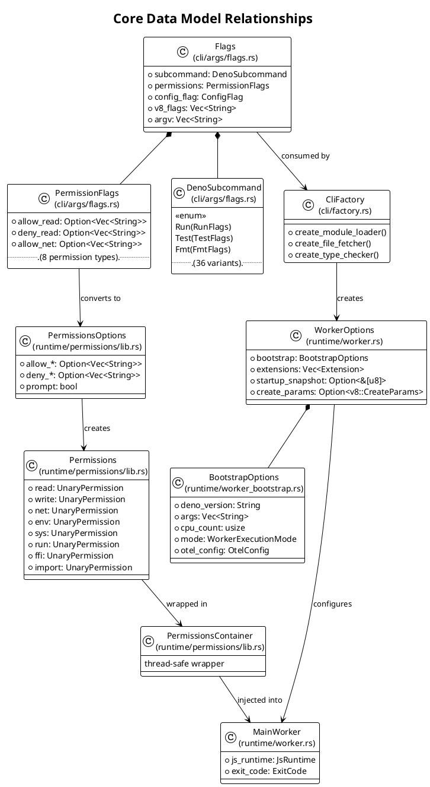
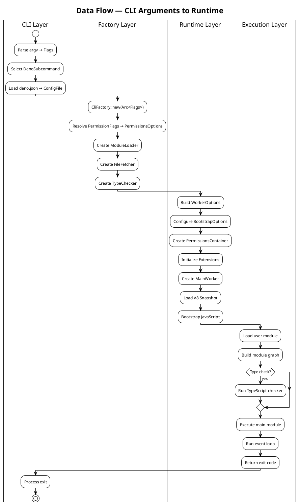

# Data Models & Schemas

## 1. Overview

Deno's core data models span the CLI configuration layer, the runtime worker system, the permission model, and the module resolution system. This document catalogs the key types, their relationships, and how data flows between architectural layers.

## 2. Core Types — CLI Layer

### 2.1 `Flags` (cli/args/flags.rs:854)

The central configuration struct representing all parsed CLI arguments. Created once during startup and shared via `Arc<Flags>` throughout the application.

| Field | Type | Description |
|-------|------|-------------|
| `initial_cwd` | `Option<PathBuf>` | Working directory at startup |
| `argv` | `Vec<String>` | User script arguments |
| `subcommand` | `DenoSubcommand` | Selected subcommand variant |
| `frozen_lockfile` | `Option<bool>` | Error on lockfile changes |
| `ca_stores` | `Option<Vec<String>>` | CA certificate stores |
| `ca_data` | `Option<CaData>` | Custom CA certificate data |
| `cache_blocklist` | `Vec<String>` | Modules to skip caching |
| `cached_only` | `bool` | Only use cached modules |
| `type_check_mode` | `TypeCheckMode` | How to type check (all/local/none) |
| `config_flag` | `ConfigFlag` | deno.json config mode |
| `node_modules_dir` | `Option<NodeModulesDirMode>` | Node modules directory mode |
| `import_map_path` | `Option<String>` | Import map file path |
| `env_file` | `Option<Vec<String>>` | .env file paths |
| `inspect_brk` | `Option<SocketAddr>` | Inspector break address |
| `inspect_wait` | `Option<SocketAddr>` | Inspector wait address |
| `inspect` | `Option<SocketAddr>` | Inspector address |
| `location` | `Option<Url>` | `--location` flag URL |
| `lock` | `Option<String>` | Lockfile path |
| `log_level` | `Option<Level>` | Logging level |
| `no_remote` | `bool` | Disable remote modules |
| `no_lock` | `bool` | Disable lockfile |
| `no_npm` | `bool` | Disable npm support |
| `reload` | `bool` | Force reload modules |
| `seed` | `Option<u64>` | RNG seed for reproducibility |
| `unstable_config` | `UnstableConfig` | Unstable feature flags |
| `v8_flags` | `Vec<String>` | V8 engine flags |
| `code_cache_enabled` | `bool` | Enable V8 code caching |
| `permissions` | `PermissionFlags` | Permission configuration |
| `eszip` | `bool` | ESZip mode |

### 2.2 `DenoSubcommand` (cli/args/flags.rs:599)

Enum with 36 variants — one per CLI subcommand. Each variant holds its own flags struct:

```
DenoSubcommand
├── Run(RunFlags)
├── Serve(ServeFlags)
├── Eval(EvalFlags)
├── Repl(ReplFlags)
├── Fmt(FmtFlags)
├── Lint(LintFlags)
├── Test(TestFlags)
├── Bench(BenchFlags)
├── Check(CheckFlags)
├── Doc(DocFlags)
├── Coverage(CoverageFlags)
├── Compile(CompileFlags)
├── Bundle(BundleFlags)
├── Deploy(DeployFlags)
├── Publish(PublishFlags)
├── Add(AddFlags)
├── Remove(RemoveFlags)
├── Install(InstallFlags)
├── Uninstall(UninstallFlags)
├── Outdated(OutdatedFlags)
├── Audit(AuditFlags)
├── Cache(CacheFlags)
├── Info(InfoFlags)
├── Init(InitFlags)
├── Clean(CleanFlags)
├── Upgrade(UpgradeFlags)
├── Jupyter(JupyterFlags)
├── Lsp
├── Types
├── Vendor
├── X(XFlags)
├── Task(TaskFlags)
├── Completions(CompletionsFlags)
├── JSONReference(JSONReferenceFlags)
├── Help(HelpFlags)
└── ApproveScripts(ApproveScriptsFlags)
```

### 2.3 `PermissionFlags` (cli/args/flags.rs:~910)

Serializable struct that holds CLI-level permission flag values before they are resolved into the runtime `Permissions` struct.

| Field | Type | Description |
|-------|------|-------------|
| `allow_all` | `bool` | Grant all permissions |
| `allow_env` | `Option<Vec<String>>` | Allowed env vars |
| `deny_env` | `Option<Vec<String>>` | Denied env vars |
| `allow_read` | `Option<Vec<String>>` | Allowed read paths |
| `deny_read` | `Option<Vec<String>>` | Denied read paths |
| `allow_write` | `Option<Vec<String>>` | Allowed write paths |
| `deny_write` | `Option<Vec<String>>` | Denied write paths |
| `allow_net` | `Option<Vec<String>>` | Allowed network hosts |
| `deny_net` | `Option<Vec<String>>` | Denied network hosts |
| `allow_run` | `Option<Vec<String>>` | Allowed executables |
| `deny_run` | `Option<Vec<String>>` | Denied executables |
| `allow_ffi` | `Option<Vec<String>>` | Allowed FFI paths |
| `deny_ffi` | `Option<Vec<String>>` | Denied FFI paths |
| `allow_sys` | `Option<Vec<String>>` | Allowed sys APIs |
| `deny_sys` | `Option<Vec<String>>` | Denied sys APIs |
| `allow_import` | `Option<Vec<String>>` | Allowed import hosts |
| `deny_import` | `Option<Vec<String>>` | Denied import hosts |

## 3. Core Types — Runtime Layer

### 3.1 `MainWorker` (runtime/worker.rs:150)

The primary JavaScript execution context.

| Field | Type | Description |
|-------|------|-------------|
| `js_runtime` | `JsRuntime` | V8 isolate + event loop |
| `should_break_on_first_statement` | `bool` | Inspector breakpoint |
| `should_wait_for_inspector_session` | `bool` | Wait for debugger |
| `exit_code` | `ExitCode` | Process exit code |
| `bootstrap_fn_global` | `Option<v8::Global<v8::Function>>` | Bootstrap function |
| `dispatch_load_event_fn_global` | `v8::Global<v8::Function>` | Load event dispatcher |
| `dispatch_beforeunload_event_fn_global` | `v8::Global<v8::Function>` | Beforeunload dispatcher |
| `dispatch_unload_event_fn_global` | `v8::Global<v8::Function>` | Unload dispatcher |
| `dispatch_process_beforeexit_event_fn_global` | `v8::Global<v8::Function>` | Process beforeexit |
| `dispatch_process_exit_event_fn_global` | `v8::Global<v8::Function>` | Process exit |

### 3.2 `WorkerOptions` (runtime/worker.rs:221)

Configuration for creating a `MainWorker`.

| Field | Type | Description |
|-------|------|-------------|
| `bootstrap` | `BootstrapOptions` | Runtime bootstrap configuration |
| `extensions` | `Vec<Extension>` | Registered extensions |
| `startup_snapshot` | `Option<&'static [u8]>` | V8 heap snapshot |
| `skip_op_registration` | `bool` | Skip op registration (snapshot mode) |
| `create_params` | `Option<v8::CreateParams>` | V8 isolate params |
| `unsafely_ignore_certificate_errors` | `Option<Vec<String>>` | Skip cert validation |
| `seed` | `Option<u64>` | RNG seed |
| `create_web_worker_cb` | `Arc<CreateWebWorkerCb>` | Web worker factory |
| `format_js_error_fn` | `Option<Arc<FormatJsErrorFn>>` | Error formatter |
| `should_break_on_first_statement` | `bool` | Inspector breakpoint |
| `should_wait_for_inspector_session` | `bool` | Wait for debugger |
| `trace_ops` | `Option<Vec<String>>` | Op tracing patterns |
| `cache_storage_dir` | `Option<PathBuf>` | Cache storage path |
| `origin_storage_dir` | `Option<PathBuf>` | Origin storage path |
| `stdio` | `Stdio` | I/O configuration |

### 3.3 `BootstrapOptions` (runtime/worker_bootstrap.rs:93)

Initialization data passed to JavaScript during worker startup.

| Field | Type | Description |
|-------|------|-------------|
| `deno_version` | `String` | Deno version string |
| `args` | `Vec<String>` | `Deno.args` values |
| `cpu_count` | `usize` | Available CPU count |
| `log_level` | `WorkerLogLevel` | Logging level |
| `enable_op_summary_metrics` | `bool` | Op metrics enabled |
| `enable_testing_features` | `bool` | Testing mode |
| `locale` | `String` | Locale string |
| `location` | `Option<ModuleSpecifier>` | `--location` URL |
| `color_level` | `ColorLevel` | Terminal color support |
| `unstable_features` | `Vec<i32>` | Enabled unstable features |
| `user_agent` | `String` | HTTP User-Agent header |
| `inspect` | `bool` | Inspector enabled |
| `is_standalone` | `bool` | Compiled standalone binary |
| `has_node_modules_dir` | `bool` | Using node_modules |
| `mode` | `WorkerExecutionMode` | Execution mode |
| `serve_port` | `Option<u16>` | `deno serve` port |
| `serve_host` | `Option<String>` | `deno serve` host |
| `otel_config` | `OtelConfig` | OpenTelemetry config |

### 3.4 `Permissions` (runtime/permissions/lib.rs:3342)

The runtime permission state, checked on every sensitive op call.

| Field | Type | Description |
|-------|------|-------------|
| `read` | `UnaryPermission<ReadDescriptor>` | File system read |
| `write` | `UnaryPermission<WriteDescriptor>` | File system write |
| `net` | `UnaryPermission<NetDescriptor>` | Network access |
| `env` | `UnaryPermission<EnvDescriptor>` | Environment variables |
| `sys` | `UnaryPermission<SysDescriptor>` | System info |
| `run` | `UnaryPermission<AllowRunDescriptor>` | Subprocess execution |
| `ffi` | `UnaryPermission<FfiDescriptor>` | Foreign Function Interface |
| `import` | `UnaryPermission<ImportDescriptor>` | Remote module imports |

### 3.5 `PermissionsOptions` (runtime/permissions/lib.rs:3368)

Serializable options for creating the `Permissions` struct.

| Field | Type | Description |
|-------|------|-------------|
| `allow_env` / `deny_env` / `ignore_env` | `Option<Vec<String>>` | Env var permissions |
| `allow_net` / `deny_net` | `Option<Vec<String>>` | Network permissions |
| `allow_ffi` / `deny_ffi` | `Option<Vec<String>>` | FFI permissions |
| `allow_read` / `deny_read` / `ignore_read` | `Option<Vec<String>>` | Read permissions |
| `allow_run` / `deny_run` | `Option<Vec<String>>` | Run permissions |
| `allow_sys` / `deny_sys` | `Option<Vec<String>>` | Sys permissions |
| `allow_write` / `deny_write` | `Option<Vec<String>>` | Write permissions |
| `allow_import` / `deny_import` | `Option<Vec<String>>` | Import permissions |
| `prompt` | `bool` | Interactive prompt enabled |

### 3.6 `PermissionsContainer` (runtime/permissions/lib.rs:3771)

Thread-safe wrapper that provides permission checking throughout the runtime.

## 4. Relationships Diagram



## 5. Data Flow Diagram



## 6. Serialization Boundaries

### Types Crossing Serialization Boundaries

| Type | Derives | Purpose |
|------|---------|---------|
| `PermissionsOptions` | `Serialize, Deserialize` | Permission config serialization |
| `PermissionFlags` | `Serialize, Deserialize` | CLI permission flags |
| `BootstrapOptions` | Custom serialization | Passed to JS via V8 |
| `WorkerExecutionMode` | `Serialize, Deserialize` | Worker mode enum |
| `OtelConfig` | `Serialize, Deserialize` | OpenTelemetry configuration |
| `InspectPublishUid` | `Serialize, Deserialize` | Inspector UID |

### Rust ↔ JavaScript Boundary

Data crosses the Rust/JS boundary through:
1. **Op arguments/return values** — Serialized via `serde_v8` (fast zero-copy path) or `serde_json`
2. **Bootstrap data** — `BootstrapOptions` serialized to JS during worker startup
3. **Resource IDs** — Integer handles passed between Rust resource table and JS
4. **Shared buffers** — `SharedArrayBuffer` for zero-copy data passing

## References

- [cli/args/flags.rs](cli/args/flags.rs) — `Flags` (line 854), `DenoSubcommand` (line 599), `PermissionFlags` (line ~910)
- [cli/factory.rs](cli/factory.rs) — `CliFactory` service construction
- [runtime/worker.rs](runtime/worker.rs) — `MainWorker` (line 150), `WorkerOptions` (line 221)
- [runtime/worker_bootstrap.rs](runtime/worker_bootstrap.rs) — `BootstrapOptions` (line 93)
- [runtime/permissions/lib.rs](runtime/permissions/lib.rs) — `Permissions` (line 3342), `PermissionsOptions` (line 3368), `PermissionsContainer` (line 3771)
