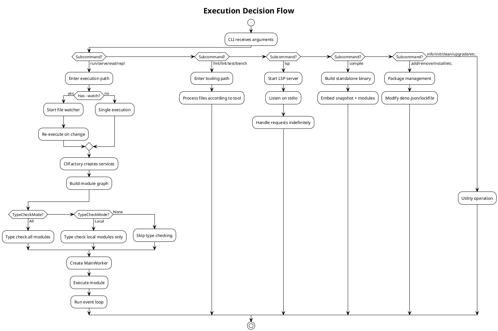

# Business Logic & Context

## 1. Purpose

Deno exists to provide a **secure, modern, and productive** runtime for JavaScript and TypeScript. It addresses limitations perceived in Node.js:

- **Security by default** — no file, network, or environment access without explicit permission grants
- **First-class TypeScript** — no separate build step required
- **Web standards alignment** — uses `fetch()`, `URL`, `Web Crypto`, etc. rather than custom APIs
- **Single binary toolchain** — formatter, linter, test runner, bundler, and LSP are all built-in
- **Decentralized module system** — URL-based imports (initially), plus JSR and npm compatibility

## 2. Key Design Decisions

| Decision | Context | Rationale | Source |
|----------|---------|-----------|--------|
| Secure-by-default sandbox | Programs can access files, network, env without consent | Every sensitive operation gated by explicit `--allow-*` flags | `runtime/permissions/lib.rs` |
| V8 snapshots for startup | Initializing Web APIs on every startup is slow | Pre-serialize V8 heap to a binary snapshot loaded at startup | `runtime/snapshot.rs` |
| Factory pattern for services | Not every subcommand needs every service | `CliFactory` lazily creates only the services needed per command | `cli/factory.rs` |
| Extensions as op bundles | Need to cleanly separate native functionality domains | Each `deno_*` crate registers its own ops + JS code | `ext/*/`, `runtime/worker.rs` |
| Module graph for deps | Need correct ordering, cycle detection, deduplication | Use `deno_graph` crate to build and traverse import graph | `cli/graph_util.rs` |
| NPM compatibility | Large ecosystem barrier without npm support | `deno_node` extension polyfills Node built-ins; `npm_installer` manages packages | `ext/node/`, `libs/npm_installer/` |
| TypeScript via tsc + SWC | Need both fast compilation and accurate type checking | SWC for fast transpile (default), tsc for type checking (`deno check`) | `cli/type_checker.rs`, `deno_ast` |
| Unified binary | Fragmented toolchains reduce DX | Single `deno` binary includes run, fmt, lint, test, compile, etc. | `cli/main.rs`, `cli/tools/` |
| URL-based module resolution | Centralized registries create single points of failure | Modules imported by URL, cached locally; JSR adds a registry option | `cli/file_fetcher.rs` |
| Resource table pattern | Need to track OS objects across Rust/JS boundary | Integer resource IDs map to typed Rust objects | `deno_core::resource_table` |
| Tower-LSP for editor support | Editors need LSP for IDE features | Full LSP implementation for VS Code and other editors | `cli/lsp/` |

## 3. Design Patterns Used

| Pattern | Where | Why |
|---------|-------|-----|
| **Factory** | `cli/factory.rs` (`CliFactory`) | Lazy creation of services per subcommand — avoids initializing everything upfront |
| **Builder** | `WorkerOptions`, `BootstrapOptions` | Complex object construction with many optional fields |
| **Strategy** | `ModuleLoader` trait, `FileSystem` trait | Multiple implementations (local/remote loading, real/virtual FS) |
| **Observer** | File watching (`--watch`), signal handling | React to file changes, OS signals |
| **Bridge** | Op system (`#[op2]`) | Decouples JavaScript API surface from Rust implementation |
| **Facade** | `MainWorker` | Unified interface to V8 isolate + event loop + extensions |
| **Resource Pool** | Resource table in `deno_core` | Manage OS resources (files, sockets) across Rust/JS boundary |
| **Chain of Responsibility** | Permission checking | Multiple permission descriptors checked in sequence |
| **Template Method** | Extension init (`init()` / `lazy_init()`) | Standard registration with extension-specific op/JS bundles |
| **Registry** | Extension registration in `common_extensions()` | Centralized registration point in `runtime/worker.rs` |

## 4. Unstable Feature Flags

All unstable features are gated behind `--unstable-<name>` flags, defined in `runtime/features/data.rs`.

### CLI-Level Features

| Feature | Flag | Env Var | Description |
|---------|------|---------|-------------|
| `bare-node-builtins` | `--unstable-bare-node-builtins` | `DENO_UNSTABLE_BARE_NODE_BUILTINS` | Import Node built-ins without `node:` prefix |
| `byonm` | `--unstable-byonm` | — | Bring-your-own node_modules |
| `detect-cjs` | `--unstable-detect-cjs` | — | Treat ambiguous files as CommonJS |
| `lazy-dynamic-imports` | `--unstable-lazy-dynamic-imports` | `DENO_UNSTABLE_LAZY_DYNAMIC_IMPORTS` | Lazy-load statically analyzable dynamic imports |
| `lockfile-v5` | `--unstable-lockfile-v5` | `DENO_UNSTABLE_LOCKFILE_V5` | Enable lockfile v5 format |
| `npm-lazy-caching` | `--unstable-npm-lazy-caching` | `DENO_UNSTABLE_NPM_LAZY_CACHING` | Download npm packages only as needed |
| `sloppy-imports` | `--unstable-sloppy-imports` | `DENO_UNSTABLE_SLOPPY_IMPORTS` | Extension probing, .js→.ts resolution |
| `subdomain-wildcards` | `--unstable-subdomain-wildcards` | `DENO_UNSTABLE_SUBDOMAIN_WILDCARDS` | `--allow-net` subdomain wildcard support |

### Runtime-Level Features

| Feature | Flag | Description |
|---------|------|-------------|
| `broadcast-channel` | `--unstable-broadcast-channel` | `BroadcastChannel` API |
| `cron` | `--unstable-cron` | `Deno.cron()` API |
| `ffi` | `--unstable-ffi` | Foreign Function Interface APIs |
| `fs` | `--unstable-fs` | Unstable file system APIs |
| `http` | `--unstable-http` | Unstable HTTP APIs |
| `kv` | `--unstable-kv` | Deno KV database APIs |
| `net` | `--unstable-net` | Unstable networking APIs |
| `no-legacy-abort` | `--unstable-no-legacy-abort` | Non-legacy abort signal in `Deno.serve` |
| `node-globals` | `--unstable-node-globals` | Prefer Node.js globals over Deno globals |
| `otel` | `--unstable-otel` | OpenTelemetry features |
| `process` | `--unstable-process` | Unstable process APIs |
| `raw-imports` | `--unstable-raw-imports` | `bytes` and `text` imports |
| `temporal` | `--unstable-temporal` | Temporal API |
| `unsafe-proto` | `--unstable-unsafe-proto` | `__proto__` support (security risk) |
| `vsock` | `--unstable-vsock` | VSOCK APIs |
| `webgpu` | `--unstable-webgpu` | WebGPU APIs |
| `worker-options` | `--unstable-worker-options` | Web Worker APIs |
| `bundle` | `--unstable-bundle` | Bundle runtime API |

## 5. Architecture Flow — Decision Points

## 6. Module Resolution Strategy

Deno supports multiple module specifier schemes, each with distinct resolution logic:

| Scheme | Example | Resolution |
|--------|---------|------------|
| `file://` | `import "./mod.ts"` | Direct file system path |
| `https://` | `import "https://deno.land/std/..."` | Fetch from URL, cache locally |
| `http://` | `import "http://..."` | Fetch from URL (insecure, requires flag) |
| `npm:` | `import "npm:express@4"` | NPM registry resolution via `npm_installer` |
| `jsr:` | `import "jsr:@std/path"` | JSR registry resolution |
| `node:` | `import "node:fs"` | Node.js built-in polyfill via `ext/node/` |
| `data:` | `import "data:text/javascript,..."` | Inline data URL |
| `blob:` | `import "blob:..."` | Blob URL reference |

## 7. Cargo Feature Flags

| Feature | Crate | Default | Purpose |
|---------|-------|---------|---------|
| `dhat-heap` | `deno` (cli) | off | Heap profiling with dhat allocator |
| `__runtime_js_sources` | `deno_runtime` | off | Include JS sources (debugging) |
| `workspace` | `deno_config` | on | Workspace configuration support |
| `transpiling` | `deno_ast` | on | TypeScript transpilation |
| `module_specifier` | `deno_media_type` | on | MediaType ↔ ModuleSpecifier |
| `ffi-api` | `brotli` | on | Brotli FFI features |

## 8. Key Environment Variables

| Variable | Purpose |
|----------|---------|
| `DENO_DIR` | Override default cache/data directory |
| `DENO_LOG` | Set Rust log level (`debug`, `info`, `warn`, `error`) |
| `DENO_AUTH_TOKENS` | Authentication tokens for remote modules |
| `DENO_CERT` | Custom CA certificate for TLS |
| `DENO_TLS_CA_STORE` | System CA store to use |
| `DENO_NO_PROMPT` | Disable interactive permission prompts |
| `DENO_JOBS` | Number of parallel workers for test/bench |
| `NO_COLOR` | Disable terminal colors |
| `HTTP_PROXY` / `HTTPS_PROXY` | HTTP proxy configuration |
| `NPM_CONFIG_REGISTRY` | Custom npm registry URL |
| `DENO_UNSTABLE_*` | Enable specific unstable features |

## References

- [CLAUDE.md](CLAUDE.md) — Development guide and codebase navigation
- [cli/factory.rs](cli/factory.rs) — Factory pattern implementation
- [cli/main.rs](cli/main.rs) — Subcommand dispatch and execution flow
- [cli/module_loader.rs](cli/module_loader.rs) — Module loading strategies
- [runtime/features/data.rs](runtime/features/data.rs) — Unstable feature flag definitions
- [runtime/features/structs.rs](runtime/features/structs.rs) — Feature flag data structures
- [runtime/worker.rs](runtime/worker.rs) — Extension registration and worker creation
