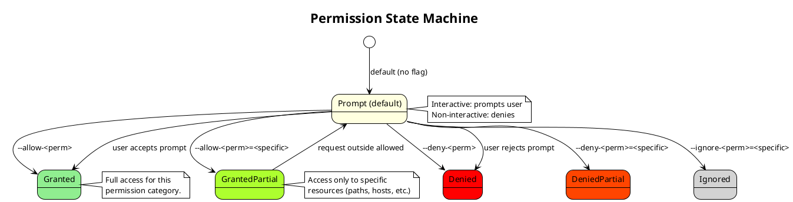
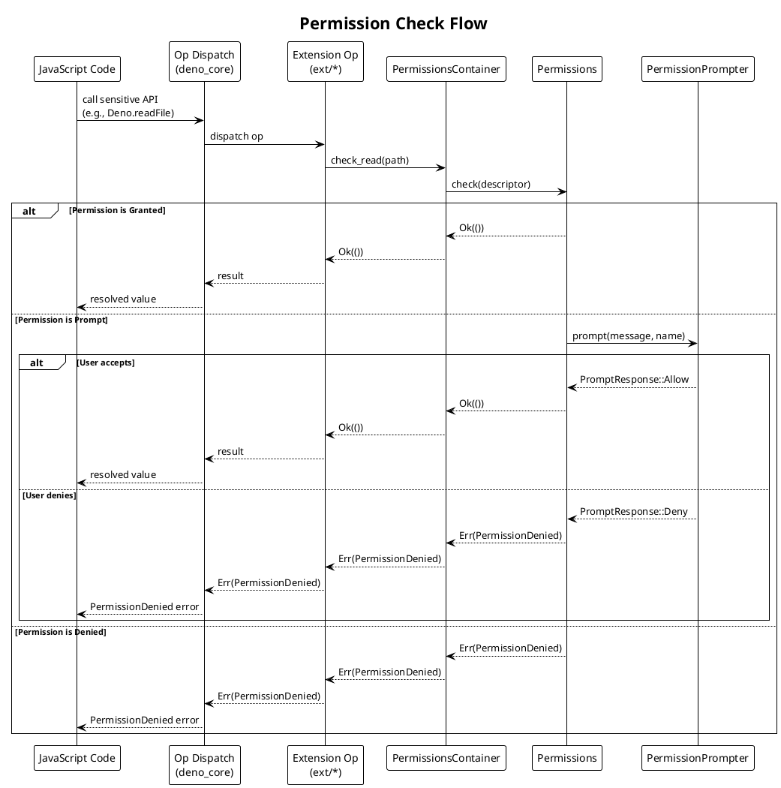
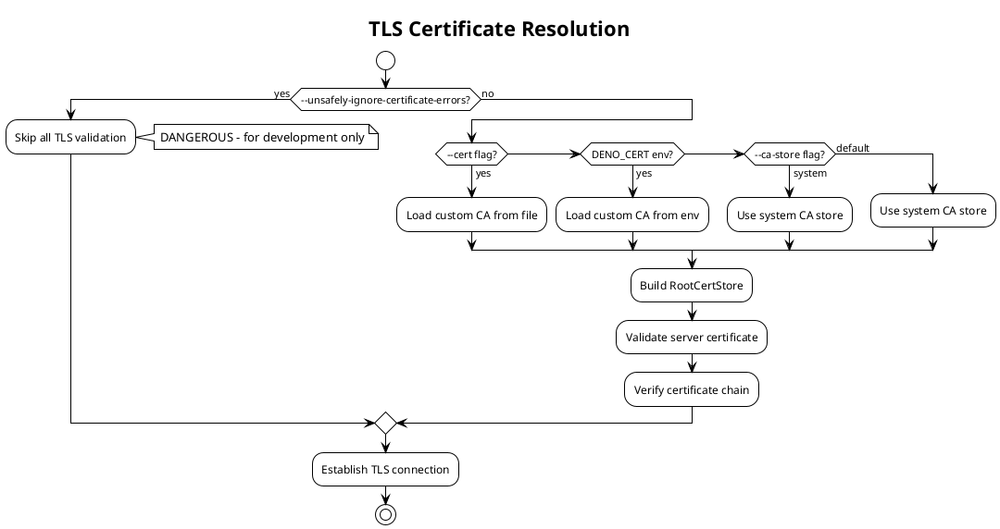

# Security & Compliance

## 1. Overview

Deno's security model is **secure-by-default**: all access to system resources (filesystem, network, environment variables, subprocess execution, FFI) is denied unless explicitly granted. This is the primary differentiator from Node.js.

## 2. Permission System Architecture

### 2.1 Permission State Machine

Each permission category operates as a state machine with the following states, defined in `runtime/permissions/lib.rs`:



### 2.2 Permission Categories

| Permission | Flag | Descriptor Type | Protects Against |
|------------|------|----------------|------------------|
| **Read** | `--allow-read` | `ReadDescriptor` | Unauthorized file system reads |
| **Write** | `--allow-write` | `WriteDescriptor` | Unauthorized file system writes |
| **Net** | `--allow-net` | `NetDescriptor` | Unauthorized network connections |
| **Env** | `--allow-env` | `EnvDescriptor` | Environment variable leakage |
| **Sys** | `--allow-sys` | `SysDescriptor` | System info exfiltration |
| **Run** | `--allow-run` | `AllowRunDescriptor` | Arbitrary command execution |
| **FFI** | `--allow-ffi` | `FfiDescriptor` | Native library code execution |
| **Import** | `--allow-import` | `ImportDescriptor` | Unauthorized remote module fetching |

### 2.3 Permission Checking Flow



### 2.4 Allow + Deny Interaction

Deno supports both `--allow-*` and `--deny-*` flags. Deny takes precedence:

| Allow | Deny | Result |
|-------|------|--------|
| `--allow-read` | (none) | All reads allowed |
| (none) | `--deny-read` | All reads denied |
| `--allow-read` | `--deny-read=/etc` | All reads except `/etc` |
| `--allow-read=/tmp` | `--deny-read=/tmp/secret` | Read `/tmp` except `/tmp/secret` |
| (none) | (none) | Prompt user (interactive) / Deny (non-interactive) |

### 2.5 Key Types

```
PermissionsContainer (thread-safe wrapper)
└── Permissions (checked on every op call)
    ├── read: UnaryPermission<ReadDescriptor>
    ├── write: UnaryPermission<WriteDescriptor>
    ├── net: UnaryPermission<NetDescriptor>
    ├── env: UnaryPermission<EnvDescriptor>
    ├── sys: UnaryPermission<SysDescriptor>
    ├── run: UnaryPermission<AllowRunDescriptor>
    ├── ffi: UnaryPermission<FfiDescriptor>
    └── import: UnaryPermission<ImportDescriptor>
```

### 2.6 Permission Prompter

Defined as a trait in `runtime/permissions/prompter.rs`:

```rust
pub trait PermissionPrompter: Send + Sync {
    fn prompt(
        &mut self,
        message: &str,
        name: &str,
        api_name: Option<&str>,
        is_unary: bool,
        get_stack: Option<GetFormattedStackFn>,
    ) -> PromptResponse;
}
```

Implementations:
- **TtyPrompter** — Interactive terminal prompt (default for CLI)
- **DeniedPrompter** — Always denies (used in non-interactive contexts, `--no-prompt`)

## 3. Cryptographic Security

### 3.1 TLS Implementation

| Component | Library | Purpose |
|-----------|---------|---------|
| TLS provider | `rustls` 0.23.28 | TLS 1.2 and 1.3 implementation |
| Crypto backend | `aws-lc-rs` 1.13.1 | Cryptographic primitives (AES, SHA, ECDSA, etc.) |
| Certificate handling | `deno_native_certs` | System CA store detection |
| X.509 parsing | `webpki` (via rustls) | Certificate validation |

### 3.2 Certificate Trust Chain



### 3.3 Web Crypto API

The `ext/crypto/` extension implements the W3C Web Crypto API specification:

| Algorithm | Operations | Key Types |
|-----------|-----------|----------|
| AES-CBC | encrypt, decrypt | 128, 192, 256 bit |
| AES-CTR | encrypt, decrypt | 128, 192, 256 bit |
| AES-GCM | encrypt, decrypt | 128, 192, 256 bit |
| AES-KW | wrapKey, unwrapKey | 128, 192, 256 bit |
| RSA-OAEP | encrypt, decrypt | 1024-8192 bit |
| RSA-PSS | sign, verify | 1024-8192 bit |
| RSASSA-PKCS1-v1_5 | sign, verify | 1024-8192 bit |
| ECDSA | sign, verify | P-256, P-384, P-521 |
| ECDH | deriveBits, deriveKey | P-256, P-384, P-521 |
| HMAC | sign, verify | variable |
| HKDF | deriveBits, deriveKey | — |
| PBKDF2 | deriveBits, deriveKey | — |
| Ed25519 | sign, verify | — |
| X25519 | deriveBits, deriveKey | — |
| SHA-1/256/384/512 | digest | — |

## 4. Sandbox Boundaries

### 4.1 What is Sandboxed

| Resource | Mechanism | Default State |
|----------|-----------|--------------|
| File system I/O | `FsPermissions` trait checks in every op | Denied |
| Network I/O | `NetDescriptor` permission checks | Denied |
| Environment variables | `EnvDescriptor` permission checks | Denied |
| System info | `SysDescriptor` permission checks | Denied |
| Subprocess execution | `RunDescriptor` permission checks | Denied |
| Native libraries (FFI) | `FfiDescriptor` permission checks | Denied |
| Remote module imports | `ImportDescriptor` permission checks | Denied |
| V8 engine | Single-threaded isolate, no shared memory by default | Sandboxed |

### 4.2 What is NOT Sandboxed

| Resource | Reason |
|----------|--------|
| CPU usage | No CPU time limits |
| Memory usage | V8 heap limits can be set via `--v8-flags=--max-old-space-size` |
| Event loop blocking | Cannot prevent synchronous CPU-bound work |
| stdout/stderr writing | Always available (needed for basic output) |

### 4.3 Clippy-Enforced Sandboxing

The codebase uses clippy `disallowed-methods` to prevent accidental sandbox bypasses:

**In `runtime/clippy.toml`:**
- `std::fs::*` — Must use `FileSystem` trait (permission-checked)
- `std::path::Path::*` FS ops — Must use `FileSystem` trait
- `std::env::current_dir` — Must use `FileSystem` trait
- `std::env::set_current_dir` — Must use `FileSystem` trait
- `std::env::temp_dir` — Must use `FileSystem` trait
- `std::process::exit` — Must use `deno_runtime::exit`

**In `cli/clippy.toml`:**
- `reqwest::Client::new` — Must use `HttpClient` via `HttpClientProvider`
- `tokio::signal::*` — Must use `deno_signals` crate

## 5. V8 Isolation

### 5.1 Isolate Model

- Each `MainWorker` has its own V8 isolate (single-threaded)
- Web Workers create additional V8 isolates (separate threads)
- **No shared memory** between isolates by default (`SharedArrayBuffer` opt-in)
- **Structured clone** for `postMessage()` between workers
- Op state is per-isolate, not shared

### 5.2 Startup Integrity

V8 snapshots contain pre-initialized built-in APIs. The snapshot is:
- Generated at build time from the registered extensions
- Loaded read-only at runtime
- Provides tamper-resistant initialization of core APIs

## 6. Supply Chain Security

| Feature | Mechanism | Purpose |
|---------|-----------|---------|
| Lockfile | `deno.lock` | Pin dependency versions and integrity hashes |
| Frozen lockfile | `--frozen-lockfile` | CI: error if lockfile would change |
| `--cached-only` | CLI flag | Only use cached modules, no network |
| `--no-remote` | CLI flag | Disable all remote module loading |
| `--no-npm` | CLI flag | Disable npm package support |
| Module integrity | Lockfile checksums | Verify module content hasn't changed |
| Certificate pinning | Custom CA support | TLS/HTTPS certificate validation |

## References

- [runtime/permissions/lib.rs](runtime/permissions/lib.rs) — Permission system core (`Permissions` at line 3342, `PermissionState` at line 133)
- [runtime/permissions/prompter.rs](runtime/permissions/prompter.rs) — Permission prompter trait (line 95)
- [runtime/permissions/broker.rs](runtime/permissions/broker.rs) — Permission broker
- [runtime/clippy.toml](runtime/clippy.toml) — Sandbox enforcement rules
- [cli/clippy.toml](cli/clippy.toml) — CLI sandbox rules
- [ext/crypto/](ext/crypto/) — Web Crypto API implementation
- [ext/tls/](ext/tls/) — TLS extension
- [libs/crypto/](libs/crypto/) — Crypto provider (`aws-lc-rs`)
