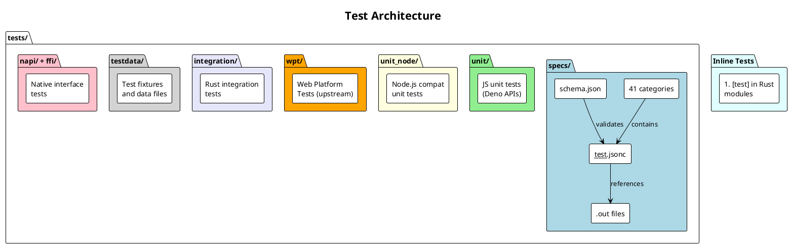

# Testing & Validation

## 1. Overview

Deno has a comprehensive, multi-layered testing strategy:

| Test Type | Location | Runner | Purpose |
|-----------|----------|--------|---------|
| Spec (integration) tests | `tests/specs/` | `cargo test specs` | CLI command execution and output assertion |
| Unit tests (Rust) | Inline `#[test]` modules | `cargo test -p <crate>` | Rust function-level testing |
| Unit tests (JS) | `tests/unit/` | Deno test runner | JavaScript API testing |
| Node.js compat tests | `tests/unit_node/` | Deno test runner | Node.js compatibility verification |
| Web Platform Tests | `tests/wpt/` | WPT harness | Web standards compliance |
| N-API tests | `tests/napi/` | `cargo test` | Native addon compatibility |
| FFI tests | `tests/ffi/` | `cargo test` | Foreign Function Interface |
| Registry tests | `tests/registry/` | Mock registry | Package registry protocol |
| Benchmarks | `tests/bench_util/` + `cli/bench/` | `cargo bench` / `deno bench` | Performance regression detection |
| Integration tests (Rust) | `tests/integration/` | `cargo test` | Cross-crate integration |

## 2. Test Architecture



## 3. Spec Tests (Primary Integration Tests)

Spec tests are the **primary** integration test mechanism for Deno. They live in `tests/specs/` and test the CLI binary end-to-end.

### 3.1 Directory Structure

```
tests/specs/
├── schema.json           # JSON Schema for __test__.jsonc
├── mod.rs                # Rust test runner
├── README.md
├── run/                  # Tests for `deno run`
│   ├── basic/
│   │   ├── __test__.jsonc
│   │   ├── main.ts
│   │   └── main.out
│   └── ...
├── test/                 # Tests for `deno test`
├── fmt/                  # Tests for `deno fmt`
├── lint/                 # Tests for `deno lint`
├── check/                # Tests for `deno check`
├── compile/              # Tests for `deno compile`
├── npm/                  # Tests for npm compatibility
├── node/                 # Tests for Node.js compat
├── jsr/                  # Tests for JSR registry
├── permission/           # Permission system tests
├── ...                   # (41 categories total)
```

### 3.2 Test Categories

| Category | Count | Tests |
|----------|-------|-------|
| `run` | Many | Script execution, watch mode, stdin |
| `test` | Many | Test runner features |
| `fmt` | Many | Formatter options |
| `lint` | Many | Linter rules |
| `check` | Many | Type checking |
| `compile` | Many | Standalone binary compilation |
| `npm` | Many | npm package support |
| `node` | Many | Node.js compatibility |
| `jsr` | Many | JSR registry |
| `permission` | Many | Permission system |
| `lockfile` | Many | Lock file handling |
| `workspaces` | Many | Multi-project workspaces |
| `serve` | Many | HTTP server |
| `repl` | Many | REPL functionality |
| `coverage` | Many | Code coverage |
| `install` | Many | Package installation |
| `add` / `remove` | Many | Dependency management |
| `outdated` | Many | Outdated package detection |
| `publish` | Many | JSR publishing |
| `task` | Many | Task runner |
| `eval` | Many | Inline evaluation |
| `info` | Many | Module info |
| `init` | Many | Project initialization |
| `cache` | Many | Module caching |
| `cert` | Many | Certificate handling |
| `bench` | Many | Benchmark runner |
| `doc` | Many | Doc generation |
| `flags` | Many | Flag parsing |
| `import_map` | Many | Import map support |
| `bundle` | Many | Module bundling |
| `jupyter` | Many | Jupyter kernel |
| `worker` | Many | Web Worker support |
| `vendor` | Many | Vendor command |
| `upgrade` | Many | Self-upgrade |
| `clean` | Many | Cache cleaning |
| `audit` | Many | Security audit |
| `x` | Many | Remote execution |
| `cli` | Many | General CLI behavior |
| `future` | Many | Future-facing features |

### 3.3 `__test__.jsonc` Schema

```json
{
  // Single test (simplest form)
  "args": "run main.ts",
  "output": "expected.out",

  // Multi-step test
  "tempDir": true,
  "steps": [
    {
      "args": "cache main.ts",
      "output": "cache.out"
    },
    {
      "args": "run main.ts",
      "output": "error.out",
      "exitCode": 1
    }
  ],

  // Multiple test cases
  "tests": {
    "test_name_1": {
      "args": "run script.ts",
      "output": "script.out"
    },
    "test_name_2": {
      "args": "run other.ts",
      "output": "other.out"
    }
  }
}
```

### 3.4 Step Properties

| Property | Type | Required | Description |
|----------|------|----------|-------------|
| `args` | `string \| string[]` | Yes | CLI arguments (auto-prepends `deno`) |
| `output` | `string` | Yes | `.out` file path or inline pattern |
| `exitCode` | `number` | No | Expected exit code (default: 0) |
| `flaky` | `boolean` | No | Retry up to 3 times on failure |
| `if` | `"windows" \| "linux" \| "mac" \| "unix"` | No | Platform condition |
| `cwd` | `string` | No | Working directory override |
| `commandName` | `string` | No | Override command (default: `deno`) |
| `envs` | `object` | No | Environment variables |

### 3.5 Output Assertion Wildcards

| Pattern | Meaning | Regex Equivalent |
|---------|---------|-----------------|
| `[WILDCARD]` | Match 0+ characters including newlines | `[\s\S]*` |
| `[WILDLINE]` | Match 0+ characters until EOL | `[^\n]*` |
| `[WILDCHAR]` | Match exactly 1 character | `.` |
| `[WILDCHARS(n)]` | Match exactly n characters | `.{n}` |
| `[UNORDERED_START]`...`[UNORDERED_END]` | Lines in any order | Set comparison |
| `[# comment]` | Line comment (ignored) | — |

### 3.6 Example Spec Test

```
tests/specs/run/hello_world/
├── __test__.jsonc
├── main.ts
└── main.out
```

**`__test__.jsonc`:**
```jsonc
{
  "args": "run main.ts",
  "output": "main.out"
}
```

**`main.ts`:**
```typescript
console.log("Hello, World!");
```

**`main.out`:**
```
Hello, World!
```

## 4. Running Tests

### 4.1 Spec Tests

```bash
# Run all spec tests
cargo test specs

# Run specific category
cargo test specs::run
cargo test specs::npm

# Run specific test
cargo test specs::run::hello_world

# With output
cargo test specs::run::hello_world -- --no-capture
```

### 4.2 Rust Unit Tests

```bash
# All tests
cargo test

# Specific crate
cargo test -p deno_runtime
cargo test -p deno_fetch
cargo test -p deno_node

# Filter by test name
cargo test test_read_file
```

### 4.3 JavaScript Unit Tests

```bash
# Via cargo (runs deno internally)
cargo test --bin deno

# Or with dev build
./target/debug/deno test tests/unit/
./target/debug/deno test tests/unit_node/
```

### 4.4 Web Platform Tests

```bash
# Run WPT suite
./target/debug/deno test tests/wpt/
```

## 5. Test Patterns & Best Practices

### 5.1 Writing Spec Tests

1. **Create directory**: `tests/specs/<category>/<test_name>/`
2. **Add `__test__.jsonc`**: Define args and expected output
3. **Use `tempDir: true`**: When test creates files (e.g., node_modules)
4. **Use wildcards**: `[WILDCARD]` for non-deterministic parts (paths, timings)
5. **Use `[UNORDERED_START/END]`**: For non-deterministic ordering
6. **Platform guards**: Use `"if": "linux"` for platform-specific tests
7. **Multi-step**: Use `steps` array for sequential operations

### 5.2 Writing Rust Unit Tests

```rust
#[cfg(test)]
mod tests {
    use super::*;

    #[test]
    fn test_something() {
        // Test code
    }

    #[tokio::test]
    async fn test_async_something() {
        // Async test code
    }
}
```

### 5.3 Flaky Test Handling

- Mark with `"flaky": true` in spec tests (retries up to 3 times)
- Use `[UNORDERED_START/END]` for order-dependent output
- Avoid timing-dependent assertions

## 6. Test Infrastructure

### 6.1 Test Server (`tests/util/server/`)

A mock HTTP/HTTPS server used by integration tests to simulate:
- Remote module serving
- npm registry endpoints
- JSR registry endpoints
- Certificate testing
- Redirect chains

### 6.2 Benchmark Utilities (`tests/bench_util/`)

```rust
// Example benchmark
use deno_bench_util::*;

fn bench_something(b: &mut Bencher) {
    b.iter(|| {
        // Code to benchmark
    });
}
```

### 6.3 Test Macros (`tests/util/test_macro/`)

Custom test macros for common test patterns.

## 7. Coverage Map

| Area | Test Location | Coverage |
|------|--------------|----------|
| CLI flag parsing | `tests/specs/flags/` | Comprehensive |
| Script execution | `tests/specs/run/` | Comprehensive |
| Type checking | `tests/specs/check/` | Comprehensive |
| Formatting | `tests/specs/fmt/` | Comprehensive |
| Linting | `tests/specs/lint/` | Comprehensive |
| Testing (meta) | `tests/specs/test/` | Comprehensive |
| npm support | `tests/specs/npm/` | Comprehensive |
| Node.js compat | `tests/specs/node/`, `tests/unit_node/` | Extensive |
| Web APIs | `tests/unit/`, `tests/wpt/` | Extensive |
| Permission system | `tests/specs/permission/` | Comprehensive |
| LSP | `cli/lsp/` (inline tests) | Moderate → Comprehensive |
| Extensions | Each `ext/*/` has tests | Per-extension |
| Module resolution | `tests/specs/import_map/`, `tests/specs/npm/` | Comprehensive |
| Lockfile | `tests/specs/lockfile/` | Comprehensive |
| Package management | `tests/specs/add/`, `tests/specs/install/` | Comprehensive |

## References

- [tests/specs/README.md](tests/specs/README.md) — Spec test documentation
- [tests/specs/schema.json](tests/specs/schema.json) — JSON schema for `__test__.jsonc`
- [tests/specs/mod.rs](tests/specs/mod.rs) — Spec test runner implementation
- [CLAUDE.md](CLAUDE.md) — Testing commands and debugging tips
- [tests/README.md](tests/README.md) — Test suite overview
